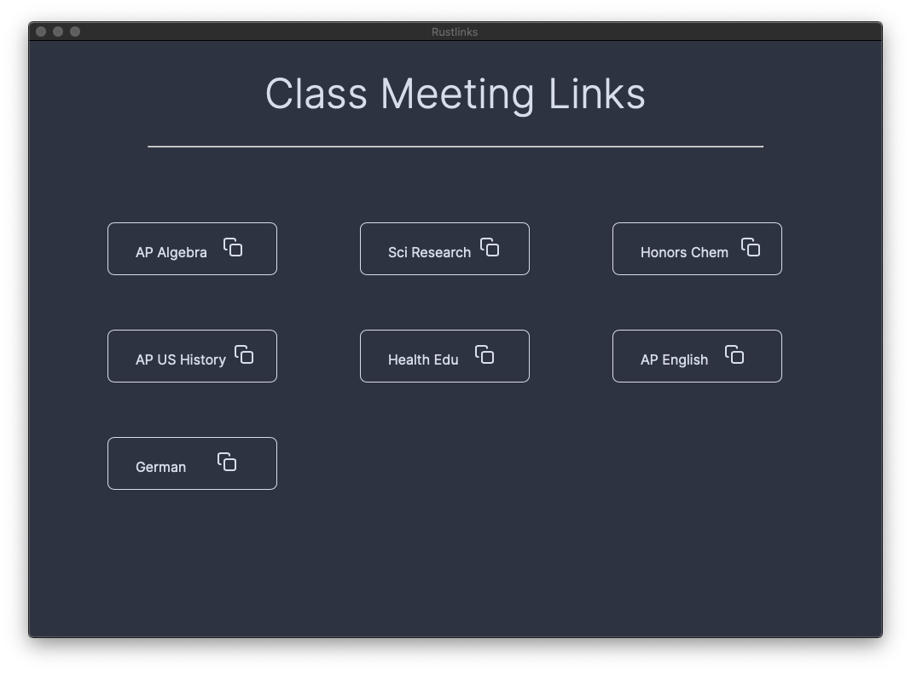

# Rustlinks

This is a very basic and lightweight app, built with `webview`, `rust`, and HTML. 

## About

Rustlinks is an app that does one (maybe two) things well:

* It has a list of all my remote classes and the links to each
* When I click on a class, it copies that link for me

Really, that's it. It's also super lightweight and fast, and has a well-designed GUI too. 

*Note that the links here aren't actually real links, they are here only for demonstration purposes and link to a placeholder webpage*

## Getting Started

To use Rustlinks, you must have `cargo` (the Rust build system installed). Rustlinks is compiled from very simple source code like this:

* I write the HTML, CSS and JavaScript separately (with no more than 300 lines of code in total)
* I then use the NPM package `inline-assets` to prepare my HTML/CSS/JS for release by bundling all assets
* Once I have my bundled `index.html`, I run `cargo new Rustlinks` and move it to the `src` folder, where my `main.rs` (app code) is
* I use the amazing `web-view` library to load my html within my `main.rs` ([here's how](https://lib.rs/crates/web-view))
* I then package it with `cargo-bundle` by installing it with `cargo install cargo-bundle` and I configure it for a MacOS build ([tutorial for this](https://github.com/burtonageo/cargo-bundle)) 
* Tada! I now have my completed app at `./target/release/bundle/osx`

This is just a prototype for many more future Rust-HTML apps that will replace my dependence on the bloated Electron framework. What's more, the compiled app has *no dependencies*, is *completely portable*, and weighs less than 2MB!
